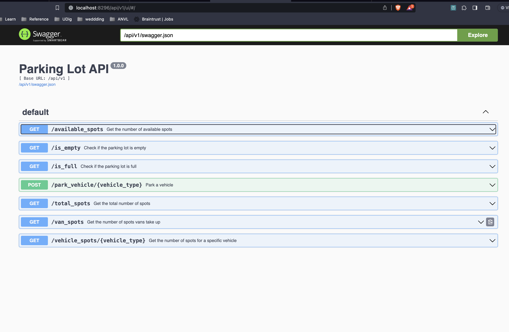

## Problem Statement
Design a parking lot. You can assume the following:
- The parking lot can hold motorcycles, cars, and vans
- The parking lot has motorcycle spots, compact spots, and regular spots
- A motorcycle can park in any spot, a car can park in either a compact or regular
spot, and a van takes up 3 regular spots

There should be an API that allows the user to do the following at any given time:
- Tell us how many spots are remaining
- Tell us how many total spots there are in the lot
- Tell us if the parking lot is full/empty
- Tell how many spots are remaining for a given car type
- Tell us how many spots vans take up

Note: This is an intentionally vague exercise, and you will have to make a number of assumptions along the way. Please include the following:

- a) Your code that would create the API above (both underlying code and the api code) 
- b) Any extra assumptions you madeand their impacts to the code or the code design 
- c) How you would push the code from a) to a production environment


## Assumptions
- Currently the parking lot is instantiated in `app/core.py`, this is not ideal for a few reasons
    - Not scalable. Wont synch the state if mupltiple containers/instances are deployed.
    - Not persistent. If application crashes state is wiped.
    - Cannot handle concurrency. If multiple requests are received simultaneously they could end up with inconsistent states.
The ideal scenario would be allowing each container instance to connect to a database, in this case I'd recommend a NoSQL solution such as DynamoDB or MongoDB. We would also need to add a parameter that represents the id of each parking lot in a multi-lot situation.

- Currently parking lot is initialized at 5 motorcycle spots, 10 compact spots, and 20 regular spots. This would need to be adjusted per parking lot.

- We are currently only keeping the aggregate state of the parking lot i.e. number of spots available by type. In a production scenario we would need to map parking lot spots to cars (via license plate) in order to ensure compliance with lot rules.

## Deployment
- Deploy versioned containers into a kubernetes environment or refactor to utilize serverless framework to deploy infrastructure as code in and AWS Lambda/API Gateway environment or Google Cloud equivalent.

### Instructions
```
docker build -t "swagger-ui" -f Dockerfile .
docker run -p 8296:8296 swagger-ui
pytest tests/test_lot.py
```
- Visit http://localhost:8296/api/v1/ui/ to see/test swagger ui and see local routes


- Code Breakdown
    - `app/`: primary Parking Lot logic and flask api
    - `assets/`: images for readme
    - `configs/`: openAPI yaml schema
    - `tests/`: suite of basic test cases
    - `Dockerfile`: dockerfile to containerize API application
    - `run.py`: entrypoint for flask app